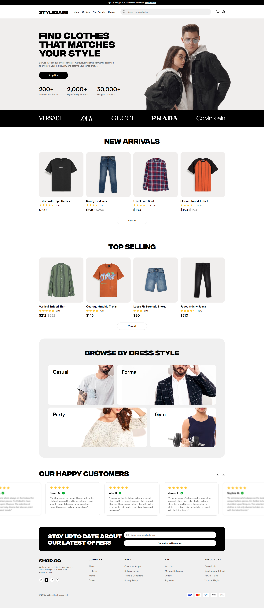
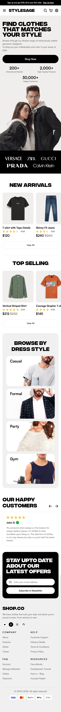

# 🛍️ Clothing Store Website

This project is an online clothing store designed to provide users with a smooth and enjoyable shopping experience. The website includes multiple pages that allow customers to browse products, view details, and manage their shopping cart.

---

## 🏠 Index Page (Home Page)

The **Index Page** serves as the main entry point of the website. It provides an overview of the store, featuring:

- Highlighted products
- Latest collections
- Promotions and special offers
- Easy navigation to categories and other pages

This page is designed to attract users and encourage them to explore the store.

---

## 👕 Product Detail Page

The **Product Detail Page** displays complete information about a selected product, including:

- Product images
- Name and price
- Available sizes and colors
- Detailed description

Users can choose product options and add items to their cart. This page helps customers make informed buying decisions.

---

## 📂 Category Page

The **Category Page** organizes products into groups such as:

- Men
- Women
- Kids
- Accessories

Features include:

- Product listing by category
- Filtering and sorting options (price, popularity, newest)

This page helps users quickly find products based on their interests.

---

## 🛒 Cart Page

The **Cart Page** shows all items added by the user for purchase. It includes:

- Product details
- Quantity selection
- Price and total cost

Users can:

- Update quantities
- Remove items
- Review their order before checkout

This page ensures a clear and smooth checkout process.

---

## 📌 Conclusion

This clothing store project focuses on providing a user-friendly interface and seamless shopping experience, from browsing products to completing a purchase.

---

## 📸 App Preview

    
    

    
    

    
    

    
    

